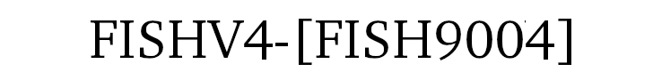

# Fishv4 - Fish segmentation



Fish detection and segmentation based on YOLOv3 that use GrabCut to do semantic segmentation to fish market images.
Trained by [FISH9004](https://github.com/DZPeru/fish-datasets)

# How to run

## Web version

You can see the DEMO [here](https://fishv4.herokuapp.com/)

## Docker version

To downloand the image and run the contaider in detach mode, run the code below.
```bash
docker container run -p 8501:8501 --rm -d pablogod/fishv4
```

To shutdown the docker type this:
```bash
docker ps -aq # Check which id was assigned for the fishv4 instance
docker stop <weird id of fishv4> # Type the id
```

## Local computer

Locally:

```bash
git clone https://github.com/DZPeru/fishv4
cd fishv4
pip3 install -r requirements.txt
gdown --output ./fishv4/fish.weights --id 1QxJHz8Lh4CRE-4ksitJkLdpOpzGFkg-l
```

## Conda version

Conda:
```bash
conda create -n fishv4 python=3.6 pip 
conda activate fishv4
pip install -r requirements.txt
```

Download the weights of the neural network to your local repository. Or do it manually, downloading from [Google Drive](https://drive.google.com/file/d/1QxJHz8Lh4CRE-4ksitJkLdpOpzGFkg-l/view?usp=sharing).

```bash
gdown --output ./fishv4/fish.weights --id 1QxJHz8Lh4CRE-4ksitJkLdpOpzGFkg-l
```

### 1. Command Line Approach
```bash
python main.py --image ./path_to/my_image.jpg --yolo yolov4
```
When finishing, you should find images (.jpg) in the project root directory.

### 2. Streamlit Approach
```bash
streamlit run app.py
```

You can upload fish market image to run the program. The results are shown in the browser (make sure to scroll down).
